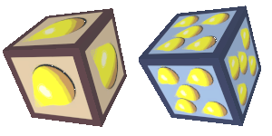
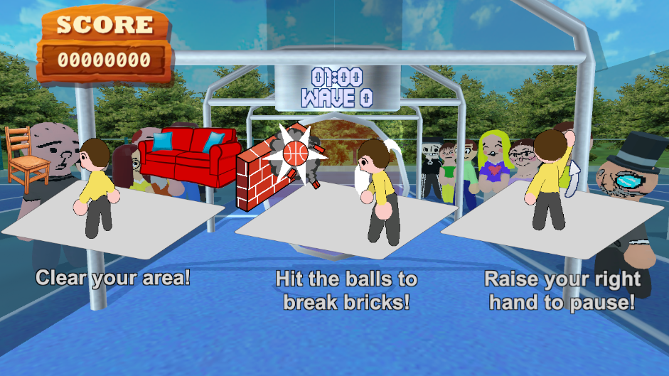

# Knect

## About

**Knect** is a demo game consisting of minigames meant to be **played with a Kinect sensor**. Alternatively, the game is fully **playable with a keyboard**.

## Getting started

1. Unity Engine is required. Download unity [here](https://unity.com/download). The project was built with version 2022.3.50f1.
2. Clone this repository.
3. Import the project from Unity Hub.

## Showcase

At the moment, only one minigame has been implemented - **Breakout** - inspired by _Kinect Adventures Rallyball_.

### Breakout

Your task is to destroy all the bricks by bouncing balls off the player. Once all the bricks have been destroyed, you advance to the next **wave**. Complete as many waves as possible before the time runs out!

**Regular bricks** (left) are breakable while **blocks of concrete** (right) aren't.

Powerup blocks can help you clear a wave. **Extra ball** (left) spawns another ball that lasts until the end of the wave. **Extra miniballs** (right) spawns five balls that last until they break a brick.

**Score multipliers** occasionally spawn out of destroyed bricks. When collected, all further points are multiplied by **x2**, **x5** or **x10** until the multiplier's timer wears off. 

**Gems** occasionally spawn out of destroyed bricks. They move quickly and their worth depends on color:
- **Pink** - 5,000
- **Blue** - 10,000
- **Green** - 25,000

#### Strategy

The most efficient way to gain points is to collect **green gems** with a **x2** multiplier. To make large combos, you should avoid the player hitting balls as much as possible. 

#### Screenshots

Logo screen at the start of the game.

Title screen.

If a Microsoft Kinect sensor is detected, a hand cursor will show up and is used to interact with the user interface. Otherwise, you may use _the arrow keys and enter_.

Main menu. The second planned game is not selectable yet.

Submenu for the Breakout game.

The left side of the screen shows your high score along with bonuses that for completing score-based milestones. For each completed milestone, the square light will light up indicating that the bonus is applied on each subsequent game.

The right side of hte screen shows a slideshow of screenshots. If you are playing with Microsoft Kinect, you can select the _Use Kinect_ button. Otherwise, the is player with a keyboard.

The tutorial is shown at the start of Breakout while the camera pans through the game scene.

Hitting 3+ bricks in a row counts as a combo and grants you bonus points. 

Once the time runs out, you gain bonus points for each ball and the audience celebrates.

At the end of the level, your results are tallied.

## Contributing

Contributions are welcome. The following is an incomplete list of potential improvements:
- Reorganizing the code
- Partial rewrite of the game
- Implementing the second minigame
- Removing all `Invoke` calls (they do not get paused with the `IPauseable` game objects)
- Replacing copyrighted assets (tennis court, menu music) with custom ones

## License

This project source code and documentation is licensed under the [BSD 2-Clause License](https://github.com/magley/slender-vr/blob/main/LICENSE).

All images, graphics, and other non-code resources, created specifically for this project, are licensed under [CC 0](https://creativecommons.org/public-domain/cc0/). 

All 3rd-party assets and libraries used in this project retain all rights under their respective licenses.